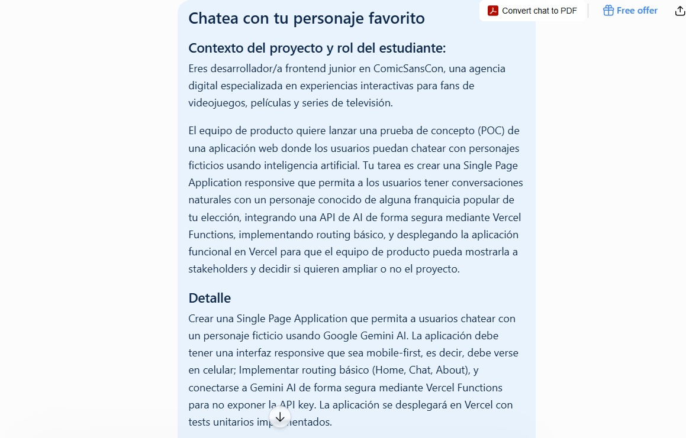

# 🍩 ComicSansCon — Homero Simpson AI

Aplicación web SPA desarrollada durante el Módulo 3 de Henry.

ComicSansCon permite conversar con **Homero Simpson** utilizando inteligencia artificial mediante la API de Google Gemini.

## 🚀 Demo

🌐 [Ver aplicación online](https://proyecto-m3-jeremias-duin.vercel.app)

## 🤖 Uso de inteligencia artificial

Durante el desarrollo del proyecto utilicé herramientas de inteligencia artificial como apoyo para comprender conceptos, resolver problemas y tomar decisiones de implementación.

Principalmente utilicé prompts orientados a:

Planificar la estructura de la aplicación.
Comprender e implementar el routing SPA.
Integrar Gemini mediante una Serverless Function.
Diseñar y ajustar el comportamiento del chat.
Resolver errores durante el desarrollo.
Crear y revisar tests con Vitest.
Mejorar la interfaz responsive.

La IA fue utilizada como herramienta de apoyo y orientación. Las decisiones finales sobre la estructura, implementación y funcionamiento del proyecto fueron revisadas y aplicadas durante el desarrollo.

### Capturas

Realicé un prompt con la descripción de las características del proyecto para cumplir con los objetivos, solicitando a ChatGPT que me vaya orientando y explicando paso por paso el código agregado.



## 🧠 ¿Qué hace la aplicación?

La aplicación permite:

* 🏠 Navegar entre Home, Chat y About.
* 🍩 Conversar con Homero Simpson mediante Gemini.
* 💬 Mantener el historial de la conversación durante la sesión.
* ⏳ Mostrar un estado de "Escribiendo..." mientras Homero responde.
* 🔄 Reintentar automáticamente cuando Gemini está temporalmente ocupado.
* 📱 Utilizar la aplicación desde dispositivos móviles, tablets y computadoras.
* 🎨 Disfrutar una interfaz inspirada en el universo de Los Simpson.

## 🛠️ Tecnologías utilizadas

* HTML5
* CSS3
* JavaScript
* Google Gemini API
* Node.js
* Vercel Serverless Functions
* Vitest
* Git
* GitHub
* Vercel

## 📁 Estructura del proyecto

```text
ProyectoM3_JeremiasDuin/
│
├── .vercel/
│
├── api/
│   └── chat.js
│
├── assets/
│   └── homero.png
│
├── css/
│   └── styles.css
│
├── js/
│   ├── app.js
│   ├── chat.js
│   └── router.js
│
├── screenshots/
│   └── Prompt1.jpeg
│
├── node_modules/
│
├── .env
├── .gitignore
├── chat.test.js
├── index.html
├── package.json
├── package-lock.json
└── README.md
```

## ⚙️ Instalación

Clonar el repositorio:

```bash
git clone https://github.com/jereduin10/ProyectoM3_JeremiasDuin.git
```

Entrar en la carpeta:

```bash
cd ProyectoM3_JeremiasDuin
```

Instalar las dependencias:

```bash
npm install
```

## 🔑 Configuración de Gemini

La aplicación utiliza una variable de entorno para proteger la API Key de Gemini.

Crear un archivo `.env` en la raíz del proyecto:

```env
GEMINI_API_KEY=tu_api_key
```

⚠️ La API Key no debe subirse a GitHub.

El archivo `.env` debe estar incluido en `.gitignore`.

## 💻 Ejecutar el proyecto

Para ejecutar el proyecto localmente:

```bash
vercel dev
```

Luego abrir la dirección local que indique Vercel en la terminal.

## 🧪 Tests

El proyecto utiliza Vitest para realizar pruebas automatizadas.

Ejecutar:

```bash
npm test
```

Actualmente cuenta con tests para:

* Validación de mensajes vacíos.
* Aceptación de mensajes con texto.
* Respuesta simulada de Homero.
* Envío del mensaje a la API.

## 🔐 Seguridad

La API Key de Gemini se utiliza exclusivamente desde la Serverless Function ubicada en:

```text
api/chat.js
```

El frontend nunca contiene directamente la API Key.

En producción, la variable `GEMINI_API_KEY` se configura como variable de entorno en Vercel.

## 🌐 Deploy

El proyecto está desplegado utilizando Vercel.

Cada cambio enviado a la rama `main` mediante GitHub genera automáticamente un nuevo deployment.

Flujo utilizado:

```text
Modificar código
      ↓
git add .
      ↓
git commit
      ↓
git push
      ↓
GitHub
      ↓
Vercel
      ↓
Nuevo deployment
```

## 🎨 Características

### Home

Presenta al personaje y permite acceder directamente al chat.

### Chat

Permite conversar con Homero Simpson utilizando Gemini y conserva el historial durante la sesión.

### About

Explica el proyecto y las tecnologías utilizadas.

### Responsive

La interfaz está adaptada para:

* 📱 Smartphones
* 📱 Tablets
* 🖥️ Desktop

## 👨‍💻 Autor

**Jeremias Duin**

Proyecto desarrollado como parte de la formación Full Stack Developer de Henry.
